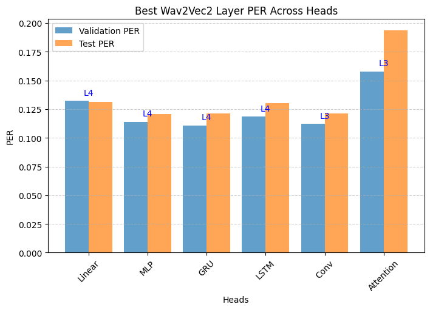
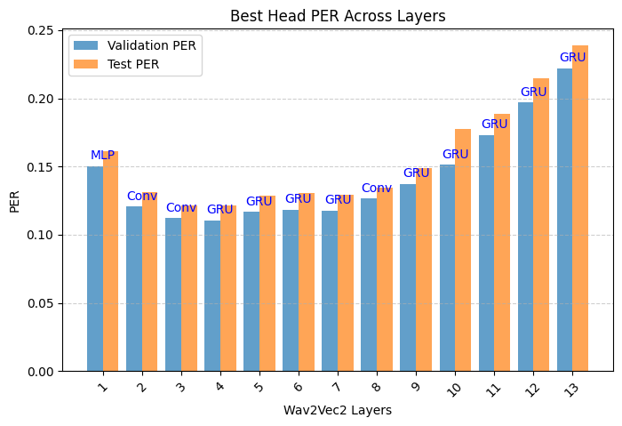
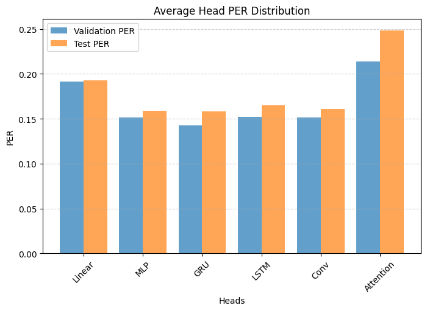
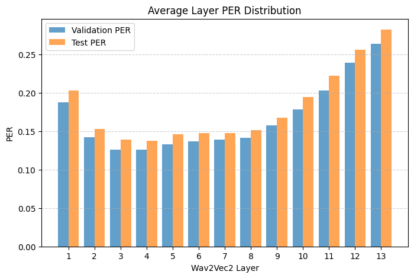

# Phoneme Recognition

Author: Artur Pelcharskyi

In this work, I experimented with different hidden layers of the Wav2Vec2 model to extract features, which were then passed to various models (Heads) for phoneme classification.

## Getting Started

All the code for this project can be found in the `Phoneme_Recognition_Wav2Vec2.ipynb` notebook. If you prefer using Google Colab, you can access it via the following link: https://colab.research.google.com/drive/1RtgTFyag1CPnmMcPqsK5CNHayLHxwkv8?usp=sharing

If you're running the notebook locally, it is recommended to install all the required libraries beforehand.

```
pip install -r requirements.txt
```

Additionally, download and unzip the dataset into the working directory using the link provided below: https://drive.google.com/file/d/15Nq4PdOY7h8AP54ge3EurUPKa91jvezc/view?usp=sharing

Finally, make sure to create the following folders before running the code: `results` and `weights/wav2vec2`.

It is highly recommended to use a GPU environment for training, as the process involves a substantial amount of computation. For reference, the total training time on an RTX 2060 with 6GB of VRAM was approximately 7 hours. Training on a CPU would be extremely slow and likely impractical.


## Results






We can conclude that for the phoneme recognition task, the most informative features in Wav2Vec2 are extracted from the fourth hidden layer from the end, and the best-performing Head is the GRU. The best overall result achieved with Wav2Vec2 was a PER of **0.1106** on the validation dataset and **0.1209** on the test dataset. This is slightly worse than the result reported by the original [Wav2Vec2](https://arxiv.org/pdf/2006.11477) authors (**0.116**).